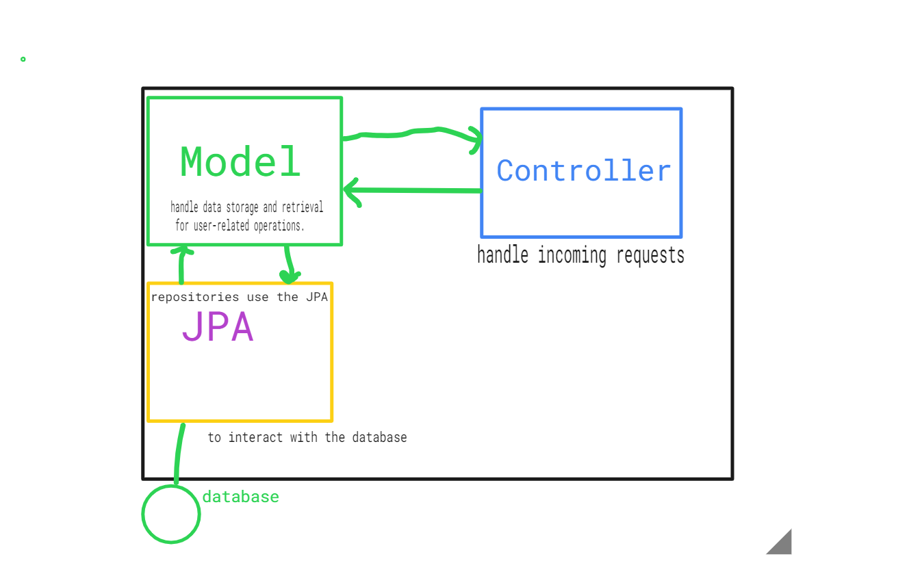
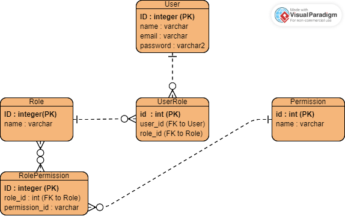

# BuilderAPI
This is a mini-project to build a user authentication and authorization system using Spring Boot and PostgreSQL. The project is designed to demonstrate how to build a monolithic backend using Spring Boot and its modules in order to create a web API using a monolithic approach.

## Table of Contents
- Project Overview
- Technologies Used
- Usage
- ERD Diagram
- MVC Diagram
- User Stories 

## Project Overview
This mini-project aims to build a user authentication and authorization system that integrates with existing applications. Users can sign up, log in, and access protected resources based on their roles and permissions. The PostgreSQL database will consist of three models: User, Role, and Permission. The application will be developed using Spring Boot and will be running on the Tomcat server.

## Technologies Used 
- Java 
- Spring Bot 
- PostgreSQL 
- Maven

## Usage
Once the application is running, you can use a tool like Postman to interact with the API. You can sign up for a new account, log in to an existing account, and access protected resources based on your user roles and permissions.

## MVC Diagram

## ERD Diagram 

### Relationships 
- The User entity is connected to the UserRole entity with a one-to-many relationship
- The Role entity is connected to the UserRole entity with a one-to-many relationship
- The Role entity is connected to the RolePermission entity with a one-to-many relationship
- The Permission entity is connected to the RolePermission entity with a many-to-one relationship,

## Project Approach
### Development Methodology: Agile

As a solo developer, Agile is a great development methodology to use because it emphasizes flexibility, collaboration, and delivering working software in short iterations. For this mini-project, I'll be using Agile as my development methodology, which means that I'll be breaking down the work into small, manageable chunks and iterating on the software over time.

### Technology Stack: Spring Boot and PostgreSQL

For this mini-project, I'll be using Spring Boot as my framework for building the API and PostgreSQL as my database. Spring Boot is a popular framework for building enterprise-level Java applications, and it provides a powerful set of tools and modules for building REST APIs. PostgreSQL is a powerful and reliable open-source relational database that's well-suited for enterprise applications.

### Project Management Tool: Github Projects

Github Projects is a great tool for solo developers because it allows me to create and manage a Kanban board that tracks the progress of the project. This will help me stay organized, prioritize tasks, and collaborate effectively with myself.

[Link to Kanban Board](https://github.com/users/builde7b0b/projects/2)

Overall, my approach to this mini-project will be to use Agile as my development methodology, Spring Boot and PostgreSQL as my technology stack, and Github Projects as my project management tool. By breaking down the work into small, manageable chunks and iterating on the software over time, I can ensure that I'm building a high-quality, well-documented API that meets the needs of my users

## User Stories 
- As a user, I want to be able to create a new account, so that I can access protected resources
- As a user, I want to be able to log in to my account, so that I can access my personal Information and protected resources.
- As a user, I want to be able to update my account information, so that my profile is accurate and up-to-date.

## Contributing 
Contributions to this project are welcome. If you find a bug or have an idea for a new feature, feel free to open an issue or submit a pull request. Before contributing, please read the Contributing Guidelines.

## Credits
This project was created by [Eugene]. Special thanks to [Suresh & Drubo] for their guidance and support.

